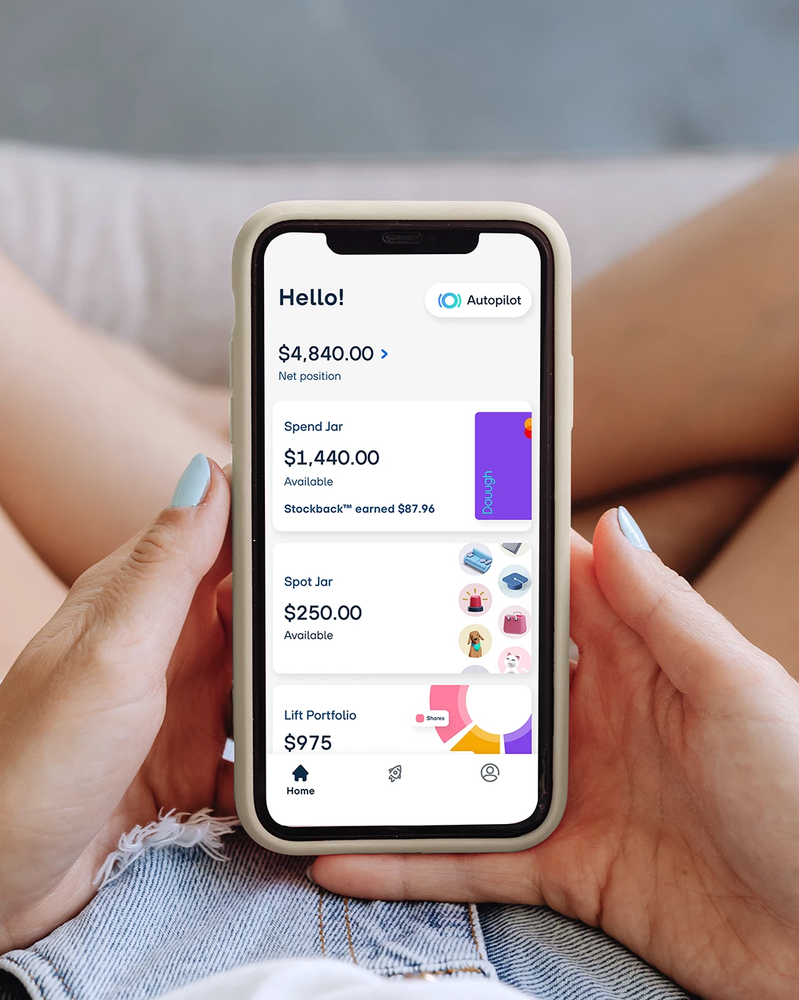

# Unit 1 Homework Assignment: Fintech Case Study

## Contents
- [Overview and Origin](#overview-and-origin)
- [Business Activities](#business-activities)
- [Landscape](#lanscape)
- [Results](#results)
- [Recommendations](#recommendations)
- [References](#references)

## Overview and Origin

**Name of company**
Douugh Ltd (ASX: DOU) formely ZipTel

**When was the company incorporated?** 
Ziptel was founded in 2016 and acquired 100% of the issued capital of Douugh Limited in March 22nd, 2020. Ziptel then changed its name to Douugh. 

**Who are the founders of the company?** 
Andy Taylor was the founder of Douugh was is also the co-founder of SocietyOne, Australia's first and leading P2P Lending Platform. 

**How did the idea for the company (or project) come about?** 
Quote from Douugh website "We believe that existing banking and investing apps in the market are not designed to help educate and inspire to adopt the right money habits to build long-term wealth and achieve financial independence, which everyone inspires to achieve. We seek to change the paradigm by using technology thats shifts the customer experience away from self-service to self-driving money management through automation." 

**How is the company funded? How much funding have they received?**
Douugh was funded with $2.5m of Seed capital in 2016 and 2017. On March 28th, 2022 there was a POST-IPO equity raise of $20m. Total of $22.5m raised in capital. 

## Business Activities:

**What specific financial problem is the company or project trying to solve?**
Douugh is on a mission to help Australian's take control of their finaces and adobt winning money habits to create long term wealth on autopilot. They are trying do do this by bringing together investing, banking, borrowing/personal lending and rewards by having the following options:
* Spend feature: spending account link to mastercard. Their feature lets you "pay now" or "pay later." Digital card only providing environmental benefits and quick access to funding. 
* Spot feature: This is the "pay later" feature. Option 1 "Spot Advance" - Borrow up to $500 on demand, deposited straight into spend account. Repay in 4x weekly instalments for a fixed $1.25 fee per repayment. Option 2 "Auto-Spot" - Pay for an item directly from the "Spot jar", so instead of money being deposited into your spend account and you being able to spend the money as you see fit you can pay for an item directly and then repay the loaned capital in four weekly installments with a $1.25 fee per week. 	
* Stockback feature: This is a reward feature. The transaction on your spend card can earn interest and when $5 is reached Douugh will invest it into your selected investment profile.
* Invest - Dough also always you to select a porfolio depending on risk (low, mederate, aggressive) to auto invest an amount you select. They also allow you to invest in US companies. The portfolios are independently managed by Blackrock. 

**Who is the company's intended customer?  Is there any information about the market size of this set of customers?**
Douugh's intended customer are everday Australian's predominetly Millennials and Gen Z's who driven to set themselves up for the future and build wealth. 
Founder and CEO Andy Taylor said *"many Aussies are currently feeling stressed about their finances thanks to the steep increase in interest rates to combat rising inflation. The Aussie dream of owning a home is now increasingly out of reach for Gen-Z and many Millennials,”* he said. *“On top of this, we are seeing an increase in the use of revolving credit cards to help smooth their cash flow, which increases the likelihood of trapping many people into a spiraling debt cycle due to compounding interest on outstanding balances.”*  [Reference](https://cdn-api.markitdigital.com/apiman-gateway/ASX/asx-research/1.0/file/2924-02676277-6A1154147?access_token=83ff96335c2d45a094df02a206a39ff4)

**What solution does this company offer that their competitors do not or cannot offer? (What is the unfair advantage they utilize?)**
Douugh is offering the world's first Pay Now or Pay Later Stockback rewards Mastercard, which as mentioned before allows you to earn interest on your transaction which will be invested in the stockmarket via Douugh's portfolios. Douugh are trying to provide a one stop shop where you can bank, invest, borrow and earn rewards all in the one spot. Therefor limiting the need for Afterpay, Paypal, Commsec, Robinhood, Frequent flyers, Flybys, ING, ANZ, ect. 

**Which technologies are they currently using, and how are they implementing them? (This may take a little bit of sleuthing–– you may want to search the company’s engineering blog or use sites like Stackshare to find this information.)**
Distribution through Merchants - Online merchants will be able to offer their customers Douughs Stockback reward program, with the option of Pay Now or Pay Later features already integrated to make to checkout experience seamless. Douugh will handle the settlements with the merchant and customers. Stockback rewards to be funded by the merchant and Douugh charging a processing fee of 2% to the merchant. This is a propretary PNPL stockback service to help increase sales and foster greater customer loyalty. This product is due to launch in Q2FY24. 

## Landscape:

**What domain of the financial industry is the company in?**
The advantage Douugh are offering is combining a few domains into one but ultimatley the would be classed in the Neo-banking domain as they are an online bank. The other domains that Douugh are bringing together are personal online banking domain with their Spend account, Lending domain with the Spot buy now pay later option and mastercard rewards system, Robo-adviser domain and capital managment domain with Douugh's auto-invest into Blackrocks ETF's or the option on buying single stocks.   

**What have been the major trends and innovations of this domain over the last 5-10 years?**
There is another domain called Neo-banking or challenger banking. After the GFC (global financial cris) the were new startup banking business' forming that challenged the traditional large banks, hence the domain challenger banking. Neobanking come about around the year 2016 with banks operating exclusively online. 
Some major trends with in the lending Domain over the last 5-10 years was the innovation of Afterpay, who started the whole buy now pay later trend, and Zip co following suit. Since the F.I.R.E (Financial Indepence, Retire Early) community came to lite around 1992 which could be credited by the best selling book "Your money or your life" by Vicky Robin, there as been as surge for investors to start investing early. Therefor there have been alot of trading apps developed like eToro, CMC Markets, Commsec Pocket, IG Trading,ect. More recently companies have been developing Robo-adviser to make investing easier for the inexperienced investors with micro-investing or developed diversified funds to invest in. Some of these companies are SoFi Automated investing, Spaceship voyager, Sharesies, Six Park, ect. 

**What are the other major companies in this domain?** 
Other major neobank companies are Tyro Payments (Business Banking), Judo Bank, Up Bank, Alex Bank, BNK and Easy Street Financial Services. The closest company I can find to Douugh is Betterment as it has checking account, Auto-investing and mastercard rewards system. Betterment does not have an app though. 

## Results

**What has been the business impact of this company so far?**
Douugh is still working towards releasing their Spend, Spot and Stockback products which are set to go live in Q4 FY23. Therefor the only revenue they have is from there current customers on the tradering platform which came from Goodments when they bought them out in Jan, 2021.

**What are some of the core metrics that companies in this domain use to measure success? How is your company performing, based on these metrics?**
Some core metrics that I have pulled from Douugh's quaterly statement would be the following. Number of customers. Douugh currently has 7,000 registered customers and 1300 active customers. Total revenue, in Q3 22-23 Douughs revenue stood at $22,848, up 475% from Q2. Average funding per month, per customer was $232. Average annualised revenue per users is currently $112. 
Key metrics to compare ASX listed companies for yr 22 would be; annual sales. Douughs annual sales was $588,364. Total compreshensive income loss for the year was -$13,487,518. Return on equity was -313.50% for 2022. Market capitalisation was sitting at $12m. Total return as percentage compare to the previous year was -85%.  

As you can see Douugh's metrics are pretty poor atm and if i was looking to invest in this company i would just yet. Although I can see the appeal for customers wanting a one stop shop for investing, banking, afterpay and rewards. Will be interesting so see how to perform in the future when all products are running. 

**How is your company performing relative to competitors in the same domain?**
Douugh has not offically launched yet so it is hard to compare it to its competitors. 
I will compare them to Raiz which is an investing platform operating in Australia, Indonesia and Malaysia. From Raiz's FY22 report they report activate customers amounting to 660,624. Funds under management $1.01B AUD. Revenue per customer $55.9 AUD. Revenue for FY22 was $18,695,000. Total compreshensive income loss for the year was -$11,249,000. As you can see Raiz has a lot more customers and generating a lot more revenue. What is interesting though is Raiz is still operating at a loss and it has been operating Australia since 2016. FUM has gone from $43m in 2016 to $996m in 2022. 
## Recommendations

**If you were to advise the company, what products or services would you suggest they offer? (This could be something that a competitor offers, or use your imagination!)**
I think a really good product to add to Douugh would be an investing for kids option. If Douugh had an option were you could create a seperate account for your kids so you could start investing for them, that would work well with their vision of building long term wealth and financial freedom. 

Another option I think Douugh should incorporate with their Spend account feauture would an AI budgeting tool that shows you were all you money is going. Examples would be expenses categories by merchants than also by category like clothes, food, fuel, ect. Also a feature showing you how much your saving, spending and investing. 

**Why do you think that offering this product or service would benefit the company?**
I think the kids investing option would be great as it leverages on what Douugh's vision is by setting you up for the future. I'm sure a lot a parents that are interested in investing wants to help their kids out, hence why other companies are offering this service as well. 

I believe a lot of aussie dont know budgeting basics and a lot of aussie are living pay check to pay check. If Douugh could help[ their customers see how they are using their money, where it is going and how they can improve would be a great benefit. 

**What technologies would this additional product or service utilize?**
I think robotic process automation and artificial intelligence. 

**Why are these technologies appropriate for your solution?**
Robotic process automation is appropriate for the kids investing product. If a customer wants to create an account for their child then it would be like filling out a form and creating an account which could be all automated and the account to be set up very quickly with all data verified on the spot. 

Artificial intelligence would be appropriate for the budgeting product as you could use algothrimns and machine learning to analyse customers accounts and procude the results needed, like mentioned above, spending habits, merchants, ect. 

### References:
https://douugh.com/investors
https://australianfintech.com.au/ziptel-asxzip-to-acquire-100pc-of-douugh/
https://www.crunchbase.com/organization/douugh
https://cdn-api.markitdigital.com/apiman-gateway/ASX/asx-research/1.0/file/2924-02676277-6A1154147?access_token=83ff96335c2d45a094df02a206a39ff4
https://australianfintech.com.au/douugh-launches-worlds-first-pay-now-or-pay-later-stockback-rewards-mastercard/
https://mymoneysorted.com.au/fire-financial-independence-retire-early-australia/
https://en.wikipedia.org/wiki/Neobank
https://www.canstar.com.au/savings-accounts/neobanks/
https://www.businessnewsaustralia.com/articles/douugh-targets-gen-y---z-investors-after-goodments-acquisition.html
https://cdn-api.markitdigital.com/apiman-gateway/ASX/asx-research/1.0/file/2924-02576237-6A1112901?access_token=83ff96335c2d45a094df02a206a39ff4
https://cdn-api.markitdigital.com/apiman-gateway/ASX/asx-research/1.0/file/2924-02638177-6A1138686?access_token=83ff96335c2d45a094df02a206a39ff4
https://cdn-api.markitdigital.com/apiman-gateway/ASX/asx-research/1.0/file/2924-02660485-6A1147859?access_token=83ff96335c2d45a094df02a206a39ff4
https://cdn-api.markitdigital.com/apiman-gateway/CommSec/commsec-node-api/1.0/event/document/1410-02558086-7K5N758H2UUF4T1PJ11DLI3F0T/pdf?access_token=00074pb8dw3feb1FhgQPLCnaPIoG
https://www.avenga.com/magazine/fintech-industry-trends/

